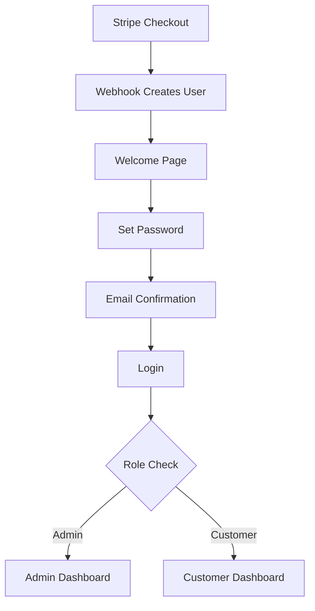

# DetailFlow System Bible - Complete Platform Documentation

## Executive Summary

DetailFlow (Detailor) is an enterprise-grade, multi-tenant SaaS platform for UK mobile detailing businesses. Built on Next.js 14 and Supabase, it provides complete business management including bookings, customers, payments, and white-label capabilities.

---

## Table of Contents

1. [Core Architecture](#core-architecture)
2. [Backend System (BE)](#backend-system)
3. [Frontend System (FE)](#frontend-system)
4. [Database Schema](#database-schema)
5. [Authentication & Security](#authentication-security)
6. [API Architecture](#api-architecture)
7. [Design System](#design-system)
8. [Deployment & Operations](#deployment-operations)

---

## Core Architecture

### Technology Stack

**Backend:**
- Supabase (PostgreSQL + Auth + Realtime)
- Next.js 14 API Routes (App Router)
- Stripe (Payments)
- Resend (Email)
- Twilio (SMS - pending)

**Frontend:**
- Next.js 14 (App Router)
- TypeScript
- Tailwind CSS
- Shadcn/ui Components
- React Hook Form
- Zustand (State Management)

**Infrastructure:**
- Vercel (Hosting)
- Supabase Cloud (Database)
- Stripe (Payment Processing)
- CloudFlare (CDN/DNS)

### Multi-Tenant Architecture

```
Tenant Isolation Strategy:
- Row-Level Security (RLS) on all tables
- tenant_id on every domain table
- Automatic tenant scoping via auth context
- No cross-tenant data exposure
```

---

## Backend System

### BE-0: Prerequisites & Setup

**Database Configuration:**
```sql
-- Core tables structure
auth.users          -- Supabase Auth
public.profiles     -- User profiles with roles
public.tenants      -- Business tenants
public.subscriptions -- Stripe subscriptions
```

**Environment Variables:**
```
NEXT_PUBLIC_SUPABASE_URL
NEXT_PUBLIC_SUPABASE_ANON_KEY
SUPABASE_SERVICE_ROLE_KEY
STRIPE_SECRET_KEY
STRIPE_WEBHOOK_SECRET
RESEND_API_KEY
```

### BE-1: Identity & Tenancy

**User Roles:**
- `customer` - End customers booking services
- `staff` - Employees executing jobs  
- `admin` - Business owners
- `super_admin` - Platform administrators

**Profile Structure:**
```typescript
interface Profile {
  id: string
  user_id: string // auth.users reference
  tenant_id: string
  role: 'customer' | 'staff' | 'admin' | 'super_admin'
  email: string
  full_name: string
  created_at: Date
}
```

### BE-2: Catalog & Pricing

**Service Management:**
```typescript
interface Service {
  id: string
  tenant_id: string
  name: string
  description: string
  base_price: number
  duration_minutes: number
  category: string
  visibility: 'public' | 'private'
  add_ons: AddOn[]
}
```

**Pricing Configuration:**
```typescript
interface PricingConfig {
  vehicle_multipliers: {
    small: 1.0
    medium: 1.2
    large: 1.5
    xlarge: 1.8
  }
  distance_surcharge: number // per mile
  weekend_multiplier: 1.2
  minimum_charge: number
}
```

### BE-3: Customer Entities

**Customer Management:**
```typescript
interface Customer {
  id: string
  tenant_id: string
  profile_id?: string
  email: string
  phone: string
  name: string
  vehicles: Vehicle[]
  addresses: Address[]
  bookings: Booking[]
  notes: string
  tags: string[]
  vip: boolean
  blocked: boolean
}
```

### BE-4: Availability System

**Work Patterns:**
```typescript
interface WorkPattern {
  tenant_id: string
  weekday: 0-6 // Sunday-Saturday
  start_time: string // "09:00"
  end_time: string // "17:00"
  slot_duration_min: number
  capacity: number
}
```

**Availability Engine:**
- Generate time slots from work patterns
- Apply exception dates (holidays, blackouts)
- Check booking conflicts
- Return available slots

### BE-5: Quoting System

**Quote Lifecycle:**
```typescript
interface Quote {
  id: string
  tenant_id: string
  customer_id: string
  service_id: string
  vehicle_id: string
  address_id: string
  price_breakdown: {
    base: number
    add_ons: number
    distance: number
    multipliers: number
    discount: number
    tax: number
    total: number
  }
  status: 'draft' | 'sent' | 'accepted' | 'expired'
  valid_until: Date
}
```

### BE-6: Booking System

**Booking States:**
```
pending → confirmed → in_progress → completed → paid
                ↓
            cancelled → refunded
```

**Booking Structure:**
```typescript
interface Booking {
  id: string
  tenant_id: string
  customer_id: string
  quote_id?: string
  service_id: string
  scheduled_date: Date
  time_slot: string
  duration_minutes: number
  status: BookingStatus
  payment_status: PaymentStatus
  price_snapshot: PriceBreakdown // Immutable
  notes: string
  job?: Job
}
```

### BE-7: Payments & Invoicing

**Payment Processing:**
```typescript
interface Payment {
  id: string
  booking_id: string
  stripe_payment_intent_id: string
  amount: number
  status: 'pending' | 'succeeded' | 'failed' | 'refunded'
  method: 'card' | 'cash' | 'bank_transfer'
  fee: number
  net_amount: number
  created_at: Date
}
```

**Invoice Generation:**
- Automated on payment success
- Tenant-scoped numbering
- PDF generation with branding
- Email delivery with template

### BE-8: Messaging & Automations

**Message Templates:**
- Booking confirmation
- Reminder (24h, 2h)
- Payment receipt
- Review request
- Marketing campaigns

**Automation Triggers:**
```typescript
interface AutomationTrigger {
  event: 'booking.created' | 'booking.completed' | 'payment.received'
  template_id: string
  channel: 'email' | 'sms'
  delay_minutes: number
  conditions: Record<string, any>
}
```

### BE-9: Operational Layer (Jobs)

**Job Execution:**
```typescript
interface Job {
  id: string
  booking_id: string
  assigned_to: string[] // staff IDs
  checklist: ChecklistItem[]
  started_at?: Date
  completed_at?: Date
  before_photos: string[]
  after_photos: string[]
  materials_used: Material[]
  notes: string
}
```

### BE-10: Analytics & Reporting

**Key Metrics:**
```sql
-- Revenue metrics
SELECT SUM(amount) FROM payments WHERE status = 'succeeded'

-- Booking metrics
SELECT COUNT(*) FROM bookings WHERE status = 'completed'

-- Customer metrics
SELECT COUNT(DISTINCT customer_id) FROM bookings
```

### BE-11: White-Label & Plans

**Tenant Branding:**
```typescript
interface TenantBranding {
  primary_color: string
  secondary_color: string
  logo_url: string
  company_name: string
  domain?: string
  email_footer: string
  invoice_template: string
}
```

**Subscription Plans:**
- Starter: £15/month (50 bookings)
- Professional: £35/month (200 bookings)
- Business: £75/month (unlimited)

### BE-12: Production Hardening

**Security Measures:**
- Row-Level Security (RLS) on all tables
- API rate limiting
- Input validation
- CORS configuration
- Environment isolation

---

## Frontend System

### FE-0: Design System Foundation

**Token System:**
```css
/* Color Palette */
--color-primary: #3B82F6;      /* Detailor Blue */
--color-secondary: #10B981;    /* Success Green */
--color-background: #FFFFFF;
--color-surface: #F9FAFB;
--color-text: #1F2937;
--color-border: #E5E7EB;

/* Typography */
--font-sans: 'Inter', system-ui;
--font-size-base: 14px;
--line-height-base: 1.6;

/* Spacing (8px grid) */
--space-1: 8px;
--space-2: 16px;
--space-3: 24px;
--space-4: 32px;

/* Border Radius */
--radius-sm: 6px;
--radius-md: 10px;
--radius-lg: 16px;

/* Shadows */
--shadow-sm: 0 1px 2px rgba(0,0,0,0.04);
--shadow-md: 0 4px 6px rgba(0,0,0,0.04);
--shadow-lg: 0 10px 15px rgba(0,0,0,0.04);
```

**Component Library (Shadcn-based):**
- Button, Input, Select, Checkbox, Radio
- Card, Table, Dialog, Sheet, Popover
- Toast, Alert, Badge, Avatar
- Form components with validation

### FE-1: Authentication & Routing

**Auth Flow:**
```typescript
// Session creation after Stripe payment
1. Webhook creates user with email_confirm: false
2. Welcome page updates password via API
3. User confirmed and signed in
4. Redirect based on role:
   - admin → /admin/dashboard
   - customer → /customer/dashboard
```

**Route Protection:**
```typescript
// Middleware pattern
export async function middleware(request: NextRequest) {
  const session = await getSession()
  
  if (!session) {
    return redirect('/signin')
  }
  
  if (isAdminRoute && session.role !== 'admin') {
    return redirect('/unauthorized')
  }
}
```

### FE-2: Dashboard Shell

**Layout Structure:**
```tsx
<DashboardLayout>
  <Sidebar>
    <Navigation role={user.role} />
  </Sidebar>
  <Main>
    <Header>
      <Breadcrumbs />
      <UserMenu />
    </Header>
    <Content>{children}</Content>
  </Main>
</DashboardLayout>
```

**Navigation Configuration:**
```typescript
const navConfig = {
  admin: [
    { label: 'Dashboard', href: '/admin/dashboard', icon: Home },
    { label: 'Bookings', href: '/admin/bookings', icon: Calendar },
    { label: 'Customers', href: '/admin/customers', icon: Users },
    { label: 'Quotes', href: '/admin/quotes', icon: FileText },
    { label: 'Messages', href: '/admin/messages', icon: MessageSquare },
    { label: 'Settings', href: '/admin/settings', icon: Settings }
  ],
  customer: [
    { label: 'Dashboard', href: '/customer/dashboard', icon: Home },
    { label: 'My Bookings', href: '/customer/bookings', icon: Calendar },
    { label: 'Vehicles', href: '/customer/vehicles', icon: Car },
    { label: 'Account', href: '/customer/account', icon: User }
  ]
}
```

### FE-3: Bookings Module

**Booking List View:**
```tsx
interface BookingListProps {
  view: 'calendar' | 'list'
  filters: {
    status: BookingStatus[]
    dateRange: DateRange
    service?: string
    customer?: string
  }
  onBookingClick: (booking: Booking) => void
}
```

**Booking Detail:**
- Customer information
- Vehicle details
- Service & add-ons
- Price breakdown
- Status management
- Payment tracking
- Job assignment

### FE-4: Multi-Step Booking Form

**Form Steps:**
```typescript
const bookingSteps = [
  { id: 'vehicle', label: 'Vehicle Details' },
  { id: 'service', label: 'Select Service' },
  { id: 'datetime', label: 'Date & Time' },
  { id: 'location', label: 'Service Location' },
  { id: 'review', label: 'Review & Confirm' }
]
```

**Form State Management:**
```typescript
interface BookingFormState {
  vehicle: Vehicle
  service: Service
  addOns: AddOn[]
  date: Date
  timeSlot: string
  address: Address
  notes: string
  price: PriceBreakdown
}
```

### FE-5: Customer Dashboard

**Customer Features:**
- Next booking card
- Booking history
- Vehicle management
- Address management
- Payment methods
- Profile settings

### FE-6: Admin CRM

**Customer Management:**
```typescript
interface CustomerCRM {
  search: (query: string) => Customer[]
  filter: (filters: CustomerFilters) => Customer[]
  merge: (customer1: string, customer2: string) => void
  export: (format: 'csv' | 'excel') => void
  bulkActions: (action: string, customerIds: string[]) => void
}
```

### FE-7: Payment Integration

**Payment Flow:**
```typescript
// Checkout process
1. Calculate total with pricing engine
2. Create Stripe payment intent
3. Collect payment details
4. Confirm payment
5. Update booking status
6. Generate invoice
7. Send confirmation
```

### FE-8: Tenant Settings

**Settings Sections:**
- Business Information
- Branding & Customization
- Services & Pricing
- Working Hours
- Payment Settings
- Email Templates
- Team Management

### FE-9: Messaging System

**Message Center:**
- Conversation threads
- Template management
- Bulk messaging
- SMS credit tracking
- Automation rules
- Reply handling

### FE-10: Staff Operations

**Today View:**
```typescript
interface TodayView {
  jobs: Job[]
  filters: {
    status: JobStatus
    assignee: string
  }
  actions: {
    start: (jobId: string) => void
    complete: (jobId: string) => void
    uploadPhotos: (jobId: string, photos: File[]) => void
  }
}
```

### FE-11: Analytics Dashboard

**Metrics Display:**
- Revenue charts (daily, weekly, monthly)
- Booking pipeline
- Customer acquisition
- Service popularity
- Staff performance
- Geographic distribution

### FE-12: Production Polish

**Quality Checklist:**
- [ ] WCAG AA accessibility
- [ ] Mobile responsive
- [ ] Loading states
- [ ] Error boundaries
- [ ] Empty states
- [ ] Offline handling
- [ ] Performance optimization

---

## Database Schema

### Core Tables

```sql
-- Tenants (businesses)
CREATE TABLE tenants (
  id UUID PRIMARY KEY,
  name TEXT NOT NULL,
  slug TEXT UNIQUE NOT NULL,
  plan TEXT NOT NULL,
  settings JSONB,
  branding JSONB,
  created_at TIMESTAMPTZ DEFAULT NOW()
);

-- User profiles
CREATE TABLE profiles (
  id UUID PRIMARY KEY,
  user_id UUID REFERENCES auth.users,
  tenant_id UUID REFERENCES tenants,
  role TEXT NOT NULL,
  email TEXT NOT NULL,
  full_name TEXT,
  phone TEXT,
  created_at TIMESTAMPTZ DEFAULT NOW()
);

-- Services catalog
CREATE TABLE services (
  id UUID PRIMARY KEY,
  tenant_id UUID REFERENCES tenants,
  name TEXT NOT NULL,
  description TEXT,
  base_price DECIMAL(10,2),
  duration_minutes INTEGER,
  category TEXT,
  visibility TEXT DEFAULT 'public',
  created_at TIMESTAMPTZ DEFAULT NOW()
);

-- Bookings
CREATE TABLE bookings (
  id UUID PRIMARY KEY,
  tenant_id UUID REFERENCES tenants,
  customer_id UUID REFERENCES customers,
  service_id UUID REFERENCES services,
  scheduled_date DATE,
  time_slot TEXT,
  status TEXT,
  payment_status TEXT,
  price_snapshot JSONB,
  created_at TIMESTAMPTZ DEFAULT NOW()
);

-- RLS Policies
ALTER TABLE bookings ENABLE ROW LEVEL SECURITY;

CREATE POLICY "tenant_isolation" ON bookings
  FOR ALL USING (tenant_id = auth.jwt()->>'tenant_id');
```

---

## Authentication & Security

### Authentication Flow



### Security Measures

**API Security:**
- JWT validation on all endpoints
- Rate limiting (100 req/min)
- Input sanitization
- SQL injection prevention
- XSS protection

**Data Security:**
- Encryption at rest
- TLS 1.3 in transit
- PII minimization
- GDPR compliance
- Audit logging

---

## API Architecture

### API Structure

```
/api
├── auth/
│   ├── signin
│   ├── signup
│   ├── signout
│   └── set-password
├── admin/
│   ├── bookings/
│   ├── customers/
│   ├── quotes/
│   └── services/
├── customer/
│   ├── bookings/
│   ├── vehicles/
│   └── profile/
├── webhooks/
│   └── stripe/
└── public/
    ├── availability/
    └── services/
```

### API Response Format

```typescript
interface APIResponse<T> {
  success: boolean
  data?: T
  error?: {
    code: string
    message: string
    details?: any
  }
  meta?: {
    page?: number
    total?: number
    timestamp: string
  }
}
```

---

## Design System

### Visual Hierarchy

```
Page Title (32px, bold)
  Section Header (24px, semibold)
    Card Title (18px, medium)
      Body Text (14px, regular)
        Caption (12px, regular)
```

### Component States

Every interactive component must handle:
- Default
- Hover
- Active
- Focus
- Disabled
- Loading
- Error
- Success

### Responsive Breakpoints

```css
/* Mobile First */
@media (min-width: 640px) { /* sm */ }
@media (min-width: 768px) { /* md */ }
@media (min-width: 1024px) { /* lg */ }
@media (min-width: 1280px) { /* xl */ }
```

---

## Deployment & Operations

### Environment Setup

**Development:**
```bash
npm install
npm run dev
# http://localhost:3000
```

**Production Build:**
```bash
npm run build
npm run start
```

### Deployment Pipeline

```yaml
# Vercel deployment
- Push to main branch
- Automated build
- Preview deployment
- Production deployment
- Rollback capability
```

### Monitoring

**Health Checks:**
```typescript
GET /api/health-check

Response:
{
  "status": "healthy",
  "checks": {
    "database": true,
    "redis": true,
    "stripe": true,
    "email": true
  }
}
```

**Error Tracking:**
- Sentry integration
- Error boundaries
- Structured logging
- Performance monitoring

### Backup & Recovery

**Backup Strategy:**
- Daily database backups
- Point-in-time recovery
- Backup retention: 30 days
- Disaster recovery plan

---

## Performance Targets

### Core Web Vitals

- **LCP** (Largest Contentful Paint): < 2.5s
- **FID** (First Input Delay): < 100ms
- **CLS** (Cumulative Layout Shift): < 0.1

### API Performance

- Average response time: < 200ms
- 95th percentile: < 500ms
- Uptime target: 99.9%

---

## Roadmap & Future Features

### Phase 1 (Current)
- ✅ Core booking system
- ✅ Payment processing
- ✅ Basic CRM
- ✅ Email notifications

### Phase 2 (Q1 2025)
- SMS notifications (Twilio)
- Advanced analytics
- Mobile app (React Native)
- Team scheduling

### Phase 3 (Q2 2025)
- AI-powered pricing
- Route optimization
- Inventory management
- Loyalty program

### Phase 4 (Q3 2025)
- Franchise management
- Multi-location support
- B2B partnerships
- API marketplace

---

## Support & Documentation

### Developer Resources
- API Documentation: `/docs/api`
- Component Storybook: `/storybook`
- Database Schema: `/docs/schema`
- Deployment Guide: `/docs/deployment`

### Business Resources
- User Guide: `/help`
- Admin Manual: `/admin/help`
- API Reference: `/developers`
- Status Page: `status.detailor.co.uk`

---

## License & Compliance

- GDPR Compliant
- UK Data Protection Act 2018
- PCI DSS Level 1
- ISO 27001 (pending)
- SOC 2 Type II (planned)

---

*This System Bible represents the complete architectural documentation for DetailFlow (Detailor) as of August 2025. It serves as the single source of truth for all development, deployment, and operational decisions.*


DATABASE - UPDATED

-- WARNING: This schema is for context only and is not meant to be run.
-- Table order and constraints may not be valid for execution.

CREATE TABLE public.add_ons (
  id uuid NOT NULL DEFAULT gen_random_uuid(),
  tenant_id uuid NOT NULL,
  name text NOT NULL,
  description text,
  price_delta numeric NOT NULL DEFAULT 0,
  duration_delta_min integer NOT NULL DEFAULT 0,
  compatibility jsonb NOT NULL DEFAULT '{}'::jsonb,
  created_at timestamp with time zone NOT NULL DEFAULT now(),
  updated_at timestamp with time zone NOT NULL DEFAULT now(),
  CONSTRAINT add_ons_pkey PRIMARY KEY (id),
  CONSTRAINT add_ons_tenant_id_fkey FOREIGN KEY (tenant_id) REFERENCES public.tenants(id)
);
CREATE TABLE public.addresses (
  id uuid NOT NULL DEFAULT gen_random_uuid(),
  tenant_id uuid NOT NULL,
  customer_id uuid NOT NULL,
  label text,
  address_line1 text NOT NULL,
  address_line2 text,
  city text,
  postcode text,
  lat double precision,
  lng double precision,
  access_notes text,
  is_default boolean NOT NULL DEFAULT false,
  created_at timestamp with time zone NOT NULL DEFAULT now(),
  updated_at timestamp with time zone NOT NULL DEFAULT now(),
  CONSTRAINT addresses_pkey PRIMARY KEY (id),
  CONSTRAINT addresses_tenant_id_fkey FOREIGN KEY (tenant_id) REFERENCES public.tenants(id),
  CONSTRAINT addresses_customer_id_fkey FOREIGN KEY (customer_id) REFERENCES public.customers(id)
);
CREATE TABLE public.blackouts (
  id uuid NOT NULL DEFAULT gen_random_uuid(),
  tenant_id uuid NOT NULL,
  starts_at timestamp with time zone NOT NULL,
  ends_at timestamp with time zone NOT NULL,
  reason text,
  created_at timestamp with time zone NOT NULL DEFAULT now(),
  CONSTRAINT blackouts_pkey PRIMARY KEY (id),
  CONSTRAINT blackouts_tenant_id_fkey FOREIGN KEY (tenant_id) REFERENCES public.tenants(id)
);
CREATE TABLE public.bookings (
  id uuid NOT NULL DEFAULT gen_random_uuid(),
  tenant_id uuid NOT NULL,
  customer_id uuid NOT NULL,
  vehicle_id uuid NOT NULL,
  address_id uuid NOT NULL,
  service_id uuid NOT NULL,
  addon_ids ARRAY NOT NULL DEFAULT '{}'::uuid[],
  start_at timestamp with time zone NOT NULL,
  end_at timestamp with time zone NOT NULL,
  time_range tstzrange DEFAULT tstzrange(start_at, end_at, '[)'::text),
  price_breakdown jsonb NOT NULL,
  notes_customer text,
  notes_internal text,
  status USER-DEFINED NOT NULL DEFAULT 'pending'::booking_status,
  payment_status USER-DEFINED NOT NULL DEFAULT 'unpaid'::payment_status,
  reference text NOT NULL UNIQUE,
  created_at timestamp with time zone NOT NULL DEFAULT now(),
  updated_at timestamp with time zone NOT NULL DEFAULT now(),
  CONSTRAINT bookings_pkey PRIMARY KEY (id),
  CONSTRAINT bookings_vehicle_id_fkey FOREIGN KEY (vehicle_id) REFERENCES public.vehicles(id),
  CONSTRAINT bookings_service_id_fkey FOREIGN KEY (service_id) REFERENCES public.services(id),
  CONSTRAINT bookings_tenant_id_fkey FOREIGN KEY (tenant_id) REFERENCES public.tenants(id),
  CONSTRAINT bookings_customer_id_fkey FOREIGN KEY (customer_id) REFERENCES public.customers(id),
  CONSTRAINT bookings_address_id_fkey FOREIGN KEY (address_id) REFERENCES public.addresses(id)
);
CREATE TABLE public.customers (
  id uuid NOT NULL DEFAULT gen_random_uuid(),
  tenant_id uuid NOT NULL,
  auth_user_id uuid,
  name text NOT NULL,
  email text,
  phone text,
  flags jsonb NOT NULL DEFAULT '{}'::jsonb,
  internal_notes text,
  ltv numeric DEFAULT 0,
  last_booking_at timestamp with time zone,
  consents jsonb NOT NULL DEFAULT '{}'::jsonb,
  created_at timestamp with time zone NOT NULL DEFAULT now(),
  updated_at timestamp with time zone NOT NULL DEFAULT now(),
  CONSTRAINT customers_pkey PRIMARY KEY (id),
  CONSTRAINT customers_auth_user_id_fkey FOREIGN KEY (auth_user_id) REFERENCES auth.users(id),
  CONSTRAINT customers_tenant_id_fkey FOREIGN KEY (tenant_id) REFERENCES public.tenants(id)
);
CREATE TABLE public.export_usage (
  id uuid NOT NULL DEFAULT gen_random_uuid(),
  tenant_id uuid NOT NULL,
  period_month date NOT NULL,
  exports_count integer NOT NULL DEFAULT 0,
  last_export_at timestamp with time zone,
  CONSTRAINT export_usage_pkey PRIMARY KEY (id),
  CONSTRAINT export_usage_tenant_id_fkey FOREIGN KEY (tenant_id) REFERENCES public.tenants(id)
);
CREATE TABLE public.invoice_counters (
  tenant_id uuid NOT NULL,
  current_seq integer NOT NULL DEFAULT 0,
  updated_at timestamp with time zone NOT NULL DEFAULT now(),
  CONSTRAINT invoice_counters_pkey PRIMARY KEY (tenant_id),
  CONSTRAINT invoice_counters_tenant_id_fkey FOREIGN KEY (tenant_id) REFERENCES public.tenants(id)
);
CREATE TABLE public.invoices (
  id uuid NOT NULL DEFAULT gen_random_uuid(),
  tenant_id uuid NOT NULL,
  booking_id uuid,
  number text NOT NULL,
  issue_date date NOT NULL DEFAULT CURRENT_DATE,
  due_date date,
  line_items jsonb NOT NULL DEFAULT '[]'::jsonb,
  tax_rows jsonb NOT NULL DEFAULT '[]'::jsonb,
  total numeric NOT NULL DEFAULT 0,
  paid_amount numeric NOT NULL DEFAULT 0,
  balance numeric NOT NULL DEFAULT 0,
  pdf_url text,
  created_at timestamp with time zone NOT NULL DEFAULT now(),
  updated_at timestamp with time zone NOT NULL DEFAULT now(),
  CONSTRAINT invoices_pkey PRIMARY KEY (id),
  CONSTRAINT invoices_booking_id_fkey FOREIGN KEY (booking_id) REFERENCES public.bookings(id),
  CONSTRAINT invoices_tenant_id_fkey FOREIGN KEY (tenant_id) REFERENCES public.tenants(id)
);
CREATE TABLE public.job_activity (
  id uuid NOT NULL DEFAULT gen_random_uuid(),
  tenant_id uuid NOT NULL,
  job_id uuid NOT NULL,
  actor_profile_id uuid,
  event text NOT NULL,
  payload jsonb NOT NULL DEFAULT '{}'::jsonb,
  created_at timestamp with time zone NOT NULL DEFAULT now(),
  CONSTRAINT job_activity_pkey PRIMARY KEY (id),
  CONSTRAINT job_activity_tenant_id_fkey FOREIGN KEY (tenant_id) REFERENCES public.tenants(id),
  CONSTRAINT job_activity_job_id_fkey FOREIGN KEY (job_id) REFERENCES public.jobs(id),
  CONSTRAINT job_activity_actor_profile_id_fkey FOREIGN KEY (actor_profile_id) REFERENCES public.profiles(id)
);
CREATE TABLE public.job_media (
  id uuid NOT NULL DEFAULT gen_random_uuid(),
  tenant_id uuid NOT NULL,
  job_id uuid NOT NULL,
  kind text NOT NULL CHECK (kind = ANY (ARRAY['before'::text, 'after'::text, 'other'::text])),
  url text NOT NULL,
  created_by uuid,
  created_at timestamp with time zone NOT NULL DEFAULT now(),
  CONSTRAINT job_media_pkey PRIMARY KEY (id),
  CONSTRAINT job_media_created_by_fkey FOREIGN KEY (created_by) REFERENCES public.profiles(id),
  CONSTRAINT job_media_tenant_id_fkey FOREIGN KEY (tenant_id) REFERENCES public.tenants(id),
  CONSTRAINT job_media_job_id_fkey FOREIGN KEY (job_id) REFERENCES public.jobs(id)
);
CREATE TABLE public.jobs (
  id uuid NOT NULL DEFAULT gen_random_uuid(),
  tenant_id uuid NOT NULL,
  booking_id uuid NOT NULL,
  staff_profile_id uuid,
  status USER-DEFINED NOT NULL DEFAULT 'not_started'::job_status,
  checklist jsonb NOT NULL DEFAULT '[]'::jsonb,
  notes text,
  created_at timestamp with time zone NOT NULL DEFAULT now(),
  updated_at timestamp with time zone NOT NULL DEFAULT now(),
  CONSTRAINT jobs_pkey PRIMARY KEY (id),
  CONSTRAINT jobs_tenant_id_fkey FOREIGN KEY (tenant_id) REFERENCES public.tenants(id),
  CONSTRAINT jobs_booking_id_fkey FOREIGN KEY (booking_id) REFERENCES public.bookings(id),
  CONSTRAINT jobs_staff_profile_id_fkey FOREIGN KEY (staff_profile_id) REFERENCES public.profiles(id)
);
CREATE TABLE public.message_templates (
  id uuid NOT NULL DEFAULT gen_random_uuid(),
  tenant_id uuid NOT NULL,
  key text NOT NULL,
  channel USER-DEFINED NOT NULL DEFAULT 'email'::message_channel,
  subject text,
  body_html text,
  body_text text,
  active boolean NOT NULL DEFAULT true,
  created_at timestamp with time zone NOT NULL DEFAULT now(),
  updated_at timestamp with time zone NOT NULL DEFAULT now(),
  CONSTRAINT message_templates_pkey PRIMARY KEY (id),
  CONSTRAINT message_templates_tenant_id_fkey FOREIGN KEY (tenant_id) REFERENCES public.tenants(id)
);
CREATE TABLE public.messages (
  id uuid NOT NULL DEFAULT gen_random_uuid(),
  tenant_id uuid NOT NULL,
  booking_id uuid,
  customer_id uuid,
  channel USER-DEFINED NOT NULL,
  direction USER-DEFINED NOT NULL,
  status USER-DEFINED NOT NULL DEFAULT 'queued'::message_status,
  template_key text,
  to_email text,
  to_phone text,
  subject text,
  body text,
  provider_id text,
  error_reason text,
  metadata jsonb NOT NULL DEFAULT '{}'::jsonb,
  idempotency_key text,
  created_at timestamp with time zone NOT NULL DEFAULT now(),
  updated_at timestamp with time zone NOT NULL DEFAULT now(),
  CONSTRAINT messages_pkey PRIMARY KEY (id),
  CONSTRAINT messages_customer_id_fkey FOREIGN KEY (customer_id) REFERENCES public.customers(id),
  CONSTRAINT messages_booking_id_fkey FOREIGN KEY (booking_id) REFERENCES public.bookings(id),
  CONSTRAINT messages_tenant_id_fkey FOREIGN KEY (tenant_id) REFERENCES public.tenants(id)
);
CREATE TABLE public.overage_charges (
  id uuid NOT NULL DEFAULT gen_random_uuid(),
  tenant_id uuid NOT NULL,
  billing_period date NOT NULL,
  charge_type text NOT NULL CHECK (charge_type = ANY (ARRAY['bookings'::text, 'storage'::text, 'sms'::text])),
  quantity integer NOT NULL DEFAULT 0,
  unit_price numeric NOT NULL DEFAULT 0,
  total_amount numeric NOT NULL DEFAULT 0,
  stripe_invoice_id text,
  created_at timestamp with time zone NOT NULL DEFAULT now(),
  CONSTRAINT overage_charges_pkey PRIMARY KEY (id),
  CONSTRAINT overage_charges_tenant_id_fkey FOREIGN KEY (tenant_id) REFERENCES public.tenants(id)
);
CREATE TABLE public.payments (
  id uuid NOT NULL DEFAULT gen_random_uuid(),
  tenant_id uuid NOT NULL,
  booking_id uuid,
  invoice_id uuid,
  provider USER-DEFINED NOT NULL,
  amount numeric NOT NULL,
  currency text NOT NULL DEFAULT 'GBP'::text,
  external_txn_id text,
  status USER-DEFINED NOT NULL DEFAULT 'pending'::payment_txn_status,
  fee_breakdown jsonb NOT NULL DEFAULT '{}'::jsonb,
  captured_at timestamp with time zone,
  refunded_amount numeric NOT NULL DEFAULT 0,
  idempotency_key text,
  created_at timestamp with time zone NOT NULL DEFAULT now(),
  updated_at timestamp with time zone NOT NULL DEFAULT now(),
  CONSTRAINT payments_pkey PRIMARY KEY (id),
  CONSTRAINT payments_tenant_id_fkey FOREIGN KEY (tenant_id) REFERENCES public.tenants(id),
  CONSTRAINT payments_booking_id_fkey FOREIGN KEY (booking_id) REFERENCES public.bookings(id),
  CONSTRAINT payments_invoice_id_fkey FOREIGN KEY (invoice_id) REFERENCES public.invoices(id)
);
CREATE TABLE public.plans (
  id text NOT NULL,
  name text NOT NULL,
  features jsonb NOT NULL DEFAULT '{}'::jsonb,
  created_at timestamp with time zone NOT NULL DEFAULT now(),
  CONSTRAINT plans_pkey PRIMARY KEY (id)
);
CREATE TABLE public.pricing_configs (
  id uuid NOT NULL DEFAULT gen_random_uuid(),
  tenant_id uuid NOT NULL UNIQUE,
  vehicle_tiers jsonb NOT NULL DEFAULT '{}'::jsonb,
  distance_policy jsonb NOT NULL DEFAULT '{}'::jsonb,
  temporal_multipliers jsonb NOT NULL DEFAULT '{}'::jsonb,
  minimum_callout jsonb NOT NULL DEFAULT '{}'::jsonb,
  discounts jsonb NOT NULL DEFAULT '[]'::jsonb,
  tax jsonb NOT NULL DEFAULT '{}'::jsonb,
  created_at timestamp with time zone NOT NULL DEFAULT now(),
  updated_at timestamp with time zone NOT NULL DEFAULT now(),
  CONSTRAINT pricing_configs_pkey PRIMARY KEY (id),
  CONSTRAINT pricing_configs_tenant_id_fkey FOREIGN KEY (tenant_id) REFERENCES public.tenants(id)
);
CREATE TABLE public.profiles (
  id uuid NOT NULL,
  tenant_id uuid NOT NULL CHECK (tenant_id IS NOT NULL),
  role USER-DEFINED NOT NULL,
  full_name text,
  email text,
  phone text,
  created_at timestamp with time zone NOT NULL DEFAULT now(),
  updated_at timestamp with time zone NOT NULL DEFAULT now(),
  status USER-DEFINED NOT NULL DEFAULT 'active'::user_status,
  CONSTRAINT profiles_pkey PRIMARY KEY (id),
  CONSTRAINT profiles_tenant_id_fkey FOREIGN KEY (tenant_id) REFERENCES public.tenants(id),
  CONSTRAINT profiles_id_fkey FOREIGN KEY (id) REFERENCES auth.users(id)
);
CREATE TABLE public.quotes (
  id uuid NOT NULL DEFAULT gen_random_uuid(),
  tenant_id uuid NOT NULL,
  customer_id uuid NOT NULL,
  service_id uuid NOT NULL,
  addon_ids ARRAY NOT NULL DEFAULT '{}'::uuid[],
  vehicle_size_tier text NOT NULL,
  scheduled_at timestamp with time zone,
  distance_miles numeric DEFAULT 0,
  discount_code text,
  price_breakdown jsonb NOT NULL,
  status USER-DEFINED NOT NULL DEFAULT 'draft'::quote_status,
  expires_at timestamp with time zone,
  created_at timestamp with time zone NOT NULL DEFAULT now(),
  updated_at timestamp with time zone NOT NULL DEFAULT now(),
  CONSTRAINT quotes_pkey PRIMARY KEY (id),
  CONSTRAINT quotes_customer_id_fkey FOREIGN KEY (customer_id) REFERENCES public.customers(id),
  CONSTRAINT quotes_tenant_id_fkey FOREIGN KEY (tenant_id) REFERENCES public.tenants(id),
  CONSTRAINT quotes_service_id_fkey FOREIGN KEY (service_id) REFERENCES public.services(id)
);
CREATE TABLE public.service_addons (
  service_id uuid NOT NULL,
  addon_id uuid NOT NULL,
  sort_order integer NOT NULL DEFAULT 0,
  CONSTRAINT service_addons_pkey PRIMARY KEY (service_id, addon_id),
  CONSTRAINT service_addons_service_id_fkey FOREIGN KEY (service_id) REFERENCES public.services(id),
  CONSTRAINT service_addons_addon_id_fkey FOREIGN KEY (addon_id) REFERENCES public.add_ons(id)
);
CREATE TABLE public.services (
  id uuid NOT NULL DEFAULT gen_random_uuid(),
  tenant_id uuid NOT NULL,
  name text NOT NULL,
  category text,
  description text,
  base_price numeric NOT NULL DEFAULT 0,
  base_duration_min integer NOT NULL DEFAULT 0,
  visible boolean NOT NULL DEFAULT true,
  media_refs jsonb NOT NULL DEFAULT '[]'::jsonb,
  created_at timestamp with time zone NOT NULL DEFAULT now(),
  updated_at timestamp with time zone NOT NULL DEFAULT now(),
  CONSTRAINT services_pkey PRIMARY KEY (id),
  CONSTRAINT services_tenant_id_fkey FOREIGN KEY (tenant_id) REFERENCES public.tenants(id)
);
CREATE TABLE public.subscriptions (
  id uuid NOT NULL DEFAULT gen_random_uuid(),
  tenant_id uuid NOT NULL,
  stripe_customer_id text,
  stripe_subscription_id text,
  price_id text,
  status text,
  current_period_end timestamp with time zone,
  created_at timestamp with time zone NOT NULL DEFAULT now(),
  updated_at timestamp with time zone NOT NULL DEFAULT now(),
  CONSTRAINT subscriptions_pkey PRIMARY KEY (id),
  CONSTRAINT subscriptions_tenant_id_fkey FOREIGN KEY (tenant_id) REFERENCES public.tenants(id)
);
CREATE TABLE public.tenant_invites (
  id uuid NOT NULL DEFAULT gen_random_uuid(),
  tenant_id uuid NOT NULL,
  email text NOT NULL,
  role USER-DEFINED NOT NULL,
  invited_by uuid,
  token uuid NOT NULL DEFAULT gen_random_uuid(),
  status text NOT NULL DEFAULT 'pending'::text CHECK (status = ANY (ARRAY['pending'::text, 'accepted'::text, 'revoked'::text, 'expired'::text])),
  created_at timestamp with time zone NOT NULL DEFAULT now(),
  accepted_by uuid,
  accepted_at timestamp with time zone,
  CONSTRAINT tenant_invites_pkey PRIMARY KEY (id),
  CONSTRAINT tenant_invites_invited_by_fkey FOREIGN KEY (invited_by) REFERENCES auth.users(id),
  CONSTRAINT tenant_invites_tenant_id_fkey FOREIGN KEY (tenant_id) REFERENCES public.tenants(id),
  CONSTRAINT tenant_invites_accepted_by_fkey FOREIGN KEY (accepted_by) REFERENCES auth.users(id)
);
CREATE TABLE public.tenants (
  id uuid NOT NULL DEFAULT gen_random_uuid(),
  legal_name text NOT NULL,
  trading_name text,
  contact_email text,
  plan text DEFAULT 'Starter'::text,
  brand_theme jsonb DEFAULT '{}'::jsonb,
  business_prefs jsonb DEFAULT '{}'::jsonb,
  status text NOT NULL DEFAULT 'active'::text CHECK (status = ANY (ARRAY['active'::text, 'suspended'::text, 'archived'::text])),
  created_at timestamp with time zone NOT NULL DEFAULT now(),
  updated_at timestamp with time zone NOT NULL DEFAULT now(),
  slug text,
  is_demo boolean NOT NULL DEFAULT false,
  feature_flags jsonb NOT NULL DEFAULT '{}'::jsonb,
  stripe_public_key text,
  stripe_secret_key text,
  sender_domain text,
  reply_to text,
  plan_id text,
  subdomain text UNIQUE,
  homepage_template character varying DEFAULT 'professional-clean'::character varying,
  homepage_published boolean DEFAULT false,
  homepage_content jsonb DEFAULT '{}'::jsonb,
  brand_settings jsonb DEFAULT '{}'::jsonb,
  CONSTRAINT tenants_pkey PRIMARY KEY (id),
  CONSTRAINT tenants_plan_id_fkey FOREIGN KEY (plan_id) REFERENCES public.plans(id)
);
CREATE TABLE public.usage_tracking (
  id uuid NOT NULL DEFAULT gen_random_uuid(),
  tenant_id uuid NOT NULL,
  period_month date NOT NULL,
  bookings_used integer NOT NULL DEFAULT 0,
  storage_bytes_used bigint NOT NULL DEFAULT 0,
  sms_used integer NOT NULL DEFAULT 0,
  last_updated timestamp with time zone NOT NULL DEFAULT now(),
  CONSTRAINT usage_tracking_pkey PRIMARY KEY (id),
  CONSTRAINT usage_tracking_tenant_id_fkey FOREIGN KEY (tenant_id) REFERENCES public.tenants(id)
);
CREATE TABLE public.vehicles (
  id uuid NOT NULL DEFAULT gen_random_uuid(),
  tenant_id uuid NOT NULL,
  customer_id uuid NOT NULL,
  make text NOT NULL,
  model text NOT NULL,
  year integer,
  colour text,
  size_tier text,
  vin text,
  photos jsonb NOT NULL DEFAULT '[]'::jsonb,
  notes text,
  created_at timestamp with time zone NOT NULL DEFAULT now(),
  updated_at timestamp with time zone NOT NULL DEFAULT now(),
  CONSTRAINT vehicles_pkey PRIMARY KEY (id),
  CONSTRAINT vehicles_tenant_id_fkey FOREIGN KEY (tenant_id) REFERENCES public.tenants(id),
  CONSTRAINT vehicles_customer_id_fkey FOREIGN KEY (customer_id) REFERENCES public.customers(id)
);
CREATE TABLE public.work_patterns (
  id uuid NOT NULL DEFAULT gen_random_uuid(),
  tenant_id uuid NOT NULL,
  weekday smallint NOT NULL CHECK (weekday >= 0 AND weekday <= 6),
  start_time time without time zone NOT NULL,
  end_time time without time zone NOT NULL,
  slot_duration_min integer NOT NULL CHECK (slot_duration_min > 0),
  capacity integer NOT NULL CHECK (capacity >= 0),
  created_at timestamp with time zone NOT NULL DEFAULT now(),
  updated_at timestamp with time zone NOT NULL DEFAULT now(),
  CONSTRAINT work_patterns_pkey PRIMARY KEY (id),
  CONSTRAINT work_patterns_tenant_id_fkey FOREIGN KEY (tenant_id) REFERENCES public.tenants(id)
);